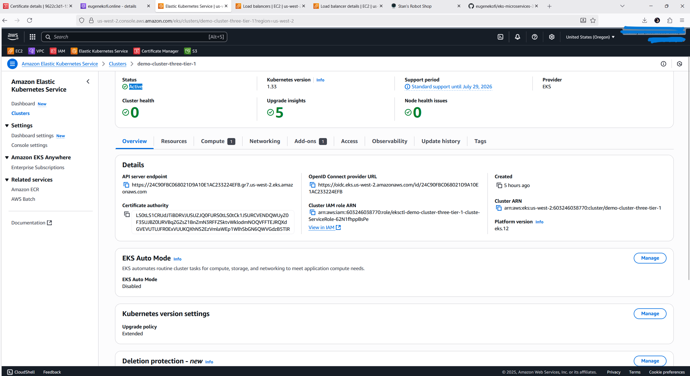
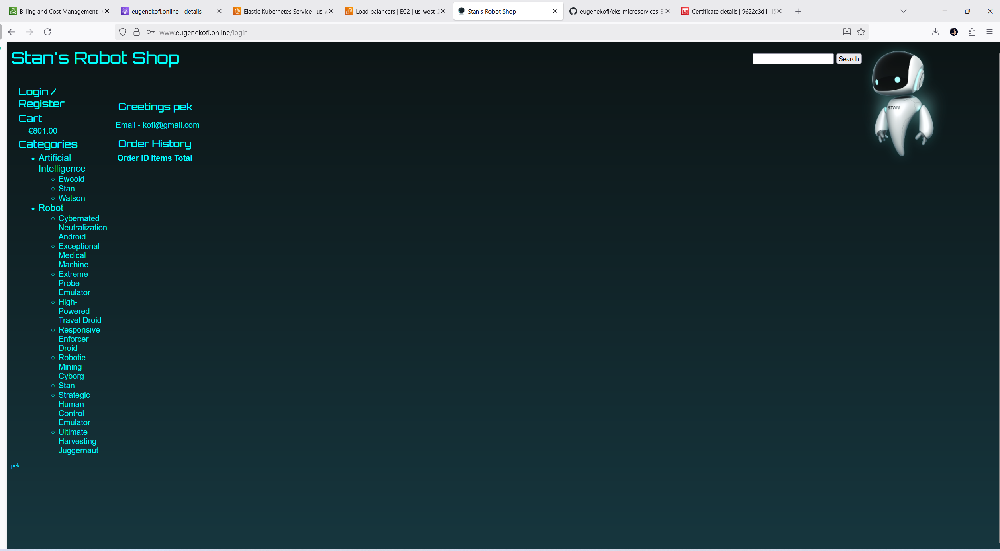

Here's a more professional, DevOps-oriented approach to the Screenshots section:

```markdown
## Infrastructure and Application Visualization

### AWS Cloud Infrastructure

<p align="center">
  
  <br>
  <em>Comprehensive AWS Cloud Infrastructure Deployment Topology</em>
</p>

### Infrastructure Components Breakdown

| Component | Details | Purpose |
|-----------|---------|---------|
| **Hosted Zone** |  | DNS Management and Custom Domain Configuration |
| **AWS ACM** |  | TLS/SSL Certificate Management for Secure Communication |
| **EKS Cluster** |  | Kubernetes Cluster Overview with Namespaces and Workload Distribution |

**Key Insights:**
- Centralized DNS management using Route 53
- Secure communication with AWS Certificate Manager
- Scalable microservices deployment on Amazon EKS

### Microservices Application Interface

<p align="center">
  
  <br>
  <em>Microservices Application Architecture and User Interface Workflow</em>
</p>

### Application User Interfaces

| Interface | Screenshot | Description | Key Features |
|-----------|------------|-------------|--------------|
| **Cart Management** |  | E-commerce Cart Workflow | - Dynamic pricing<br>- Real-time inventory<br>- Seamless checkout |
| **User Authentication** |  | Secure User Access | - Responsive design<br>- Multi-factor authentication<br>- OAuth integration |
| **Order Tracking** |  | Comprehensive Order Management | - Order history<br>- Status tracking<br>- Detailed order information |

### Advanced Interfaces

| Advanced Interface | Screenshot | Functionality |
|-------------------|------------|---------------|
| **Robot Management** |  | - Automated robot monitoring<br>- Performance analytics<br>- Real-time control dashboard |
| **AI Analytics** |  | - Predictive analytics<br>- Machine learning insights<br>- Recommendation engine |

### Technical Visualization

<p align="center">
  
  <br>
  <em>Integrated Monitoring Dashboard with Comprehensive Metrics and Logs</em>
</p>

**Monitoring Highlights:**
- Full-stack observability
- Real-time performance metrics
- Automated alerting and reporting
```

Key Improvements:
1. More structured and professional layout
2. Added context and technical descriptions
3. Included architecture and monitoring overviews
4. Used tables for better organization
5. Centered and annotated images
6. Added technical insights and key features
7. Used markdown formatting for enhanced readability

Recommendations for screenshot creation:
- Use high-resolution images
- Include annotations or highlights
- Show actual dashboards and interfaces
- Maintain consistent styling
- Focus on technical details and workflows

Would you like me to elaborate on any part of this approach?
